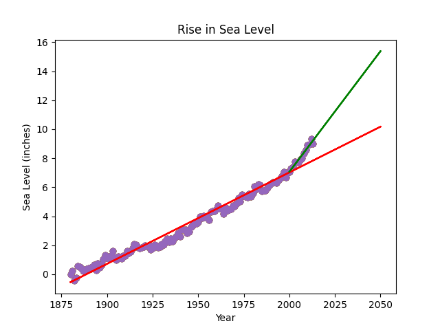

### Sea Level Predictor

###### Technologies:
<p align="center">


</p>

### Try it!

To run the Sea Level Predictor application, follow the instructions in the Setup section below.

## Project Structure

- `sea_level_predictor.py`: Contains the implementation of the sea level prediction and visualization functions.
- `main.py`: Used for development and testing the functions.
- `test_module.py`: Contains unit tests for validating the implementation.

## Setup

### Prerequisites

- Python 3 installed
- Pandas installed
- Matplotlib installed
- SciPy installed

### Installation Steps

1. Clone the repository:
   ```bash
   git clone https://github.com/creinis/sea-level-predictor-fcc-data-analyses-py-cert.git
   cd sea-level-predictor
   ```

2. Install the required libraries:
   ```bash
   pip install pandas matplotlib scipy
   ```

3. Run the Sea Level Predictor script:
   ```bash
   python3 main.py
   ```

## Sea Level Predictor

### Functionality

The Sea Level Predictor analyzes a dataset of the global average sea level change since 1880 and uses this data to predict the sea level change through the year 2050. It generates visualizations to show the trends and predictions.

### Functions

#### draw_plot Function

This function performs the following tasks:

- Reads data from `epa-sea-level.csv`.
- Creates a scatter plot using the `Year` column as the x-axis and the `CSIRO Adjusted Sea Level` column as the y-axis.
- Uses `scipy.stats.linregress` to calculate the line of best fit for the entire dataset and plots this line.
- Calculates and plots a second line of best fit using data from the year 2000 onwards.
- Adds labels for the x-axis and y-axis, and a title for the plot.
- Saves the plot as `sea_level_plot.png`.

### Practical Use Case

This predictor is useful for climate scientists, researchers, and policymakers to analyze historical sea level data and predict future trends. It can help in understanding the long-term impacts of climate change and in planning mitigation strategies.

### Benefits

- **Data Visualization:** Provides clear visualizations of historical and predicted sea level trends.
- **Efficient Data Analysis:** Utilizes Pandas and Matplotlib for efficient data manipulation and visualization.
- **Predictive Analysis:** Uses statistical methods to predict future sea levels based on historical data.

## How to Use

1. Call the `draw_plot` function to generate the sea level plot.

### Example Usage

```python
import sea_level_predictor

# Generate and save the sea level plot
sea_level_predictor.draw_plot()
```

### Example Output

**Sea Level Plot:**



### Additional Information

- **Dataset:** Global Average Absolute Sea Level Change, 1880-2014 from the US Environmental Protection Agency using data from CSIRO, 2015; NOAA, 2015.
- **Comprehensive Analysis:** Visualizes historical sea level data and predicts future trends through 2050.

---
#### This is a FreeCodeCamp Challenge for Data Analysis with Python Projects Certification.
<p align="center">

</p>
